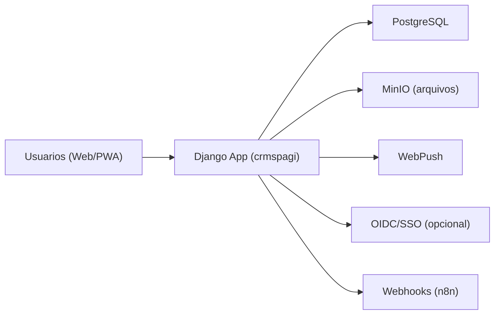
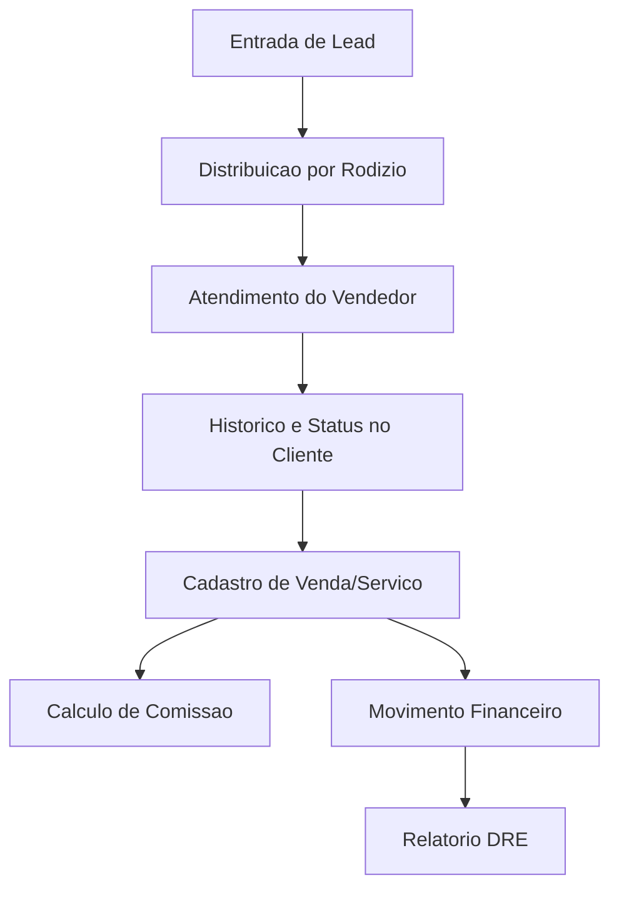
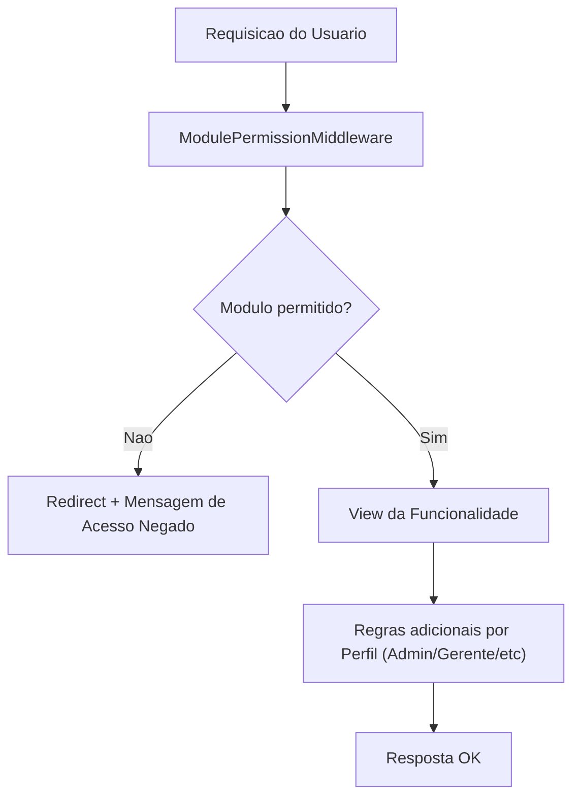
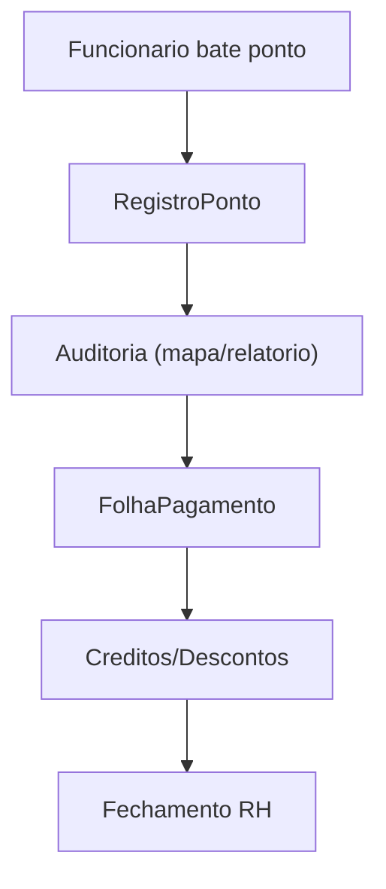
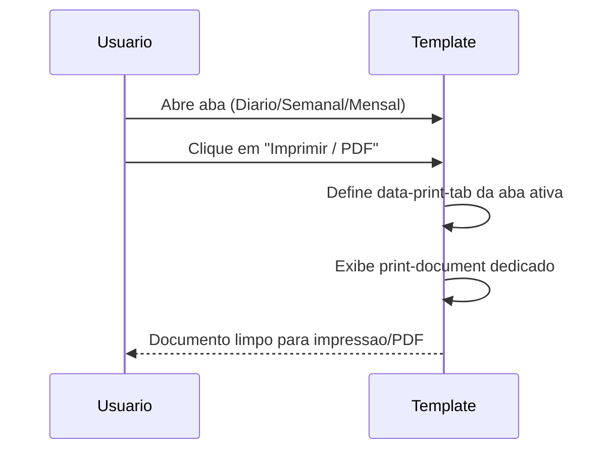
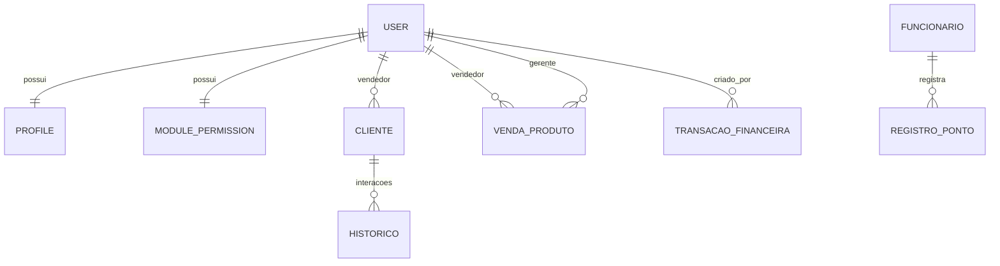
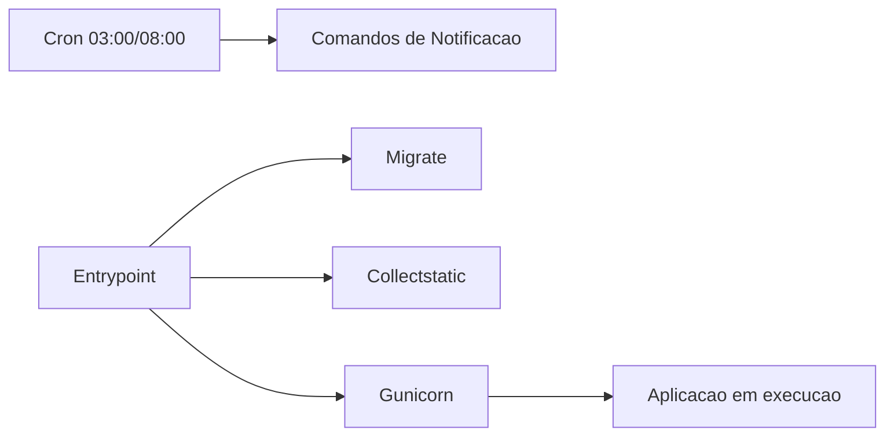

# 11 - Diagramas

## 1. Arquitetura Geral

## 2. Fluxo Comercial (Lead -> Venda -> Financeiro)

## 3. Controle de Acesso (Perfil + Modulo)

## 4. Fluxo de Ponto e RH

## 5. Impressao de Relatorio de Distribuicao

## 6. Entidades Principais (Visao simplificada)

## 7. Operacao e Rotina

