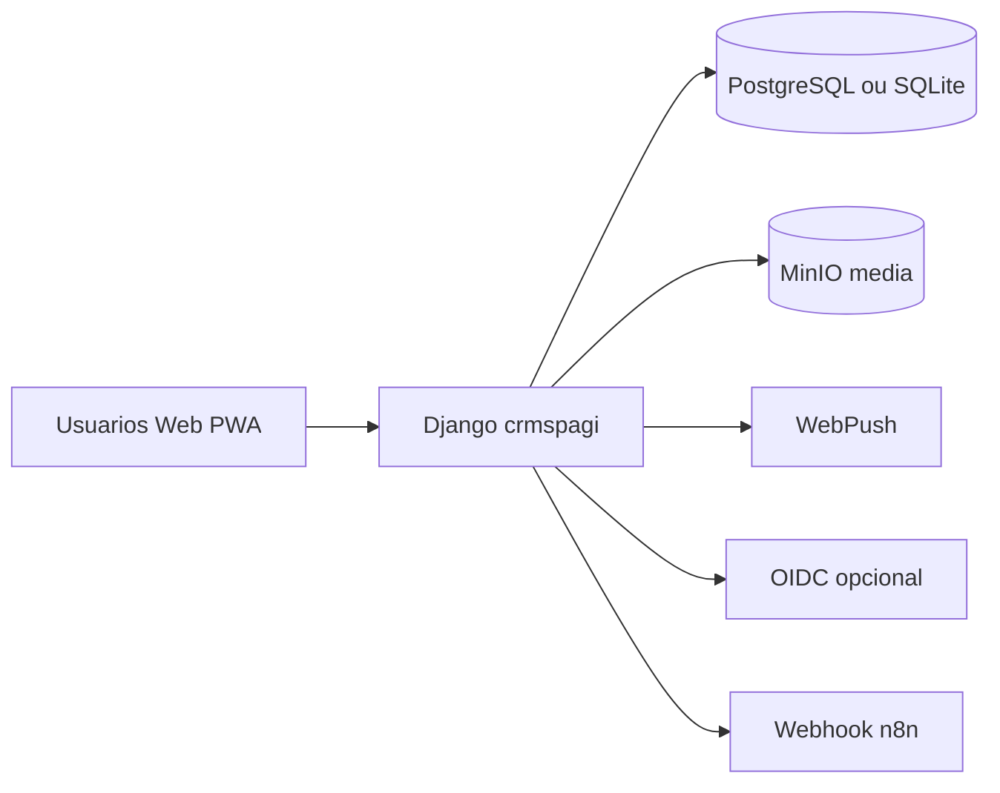
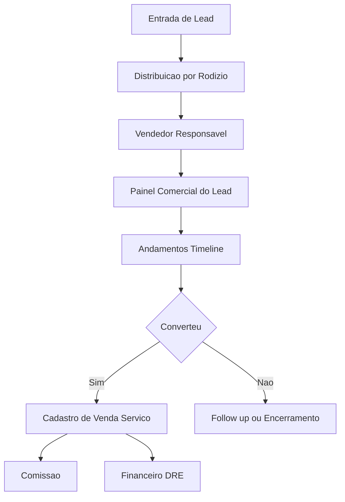
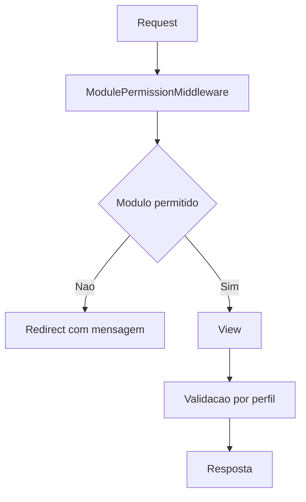
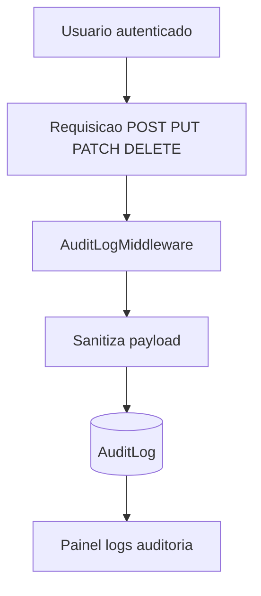
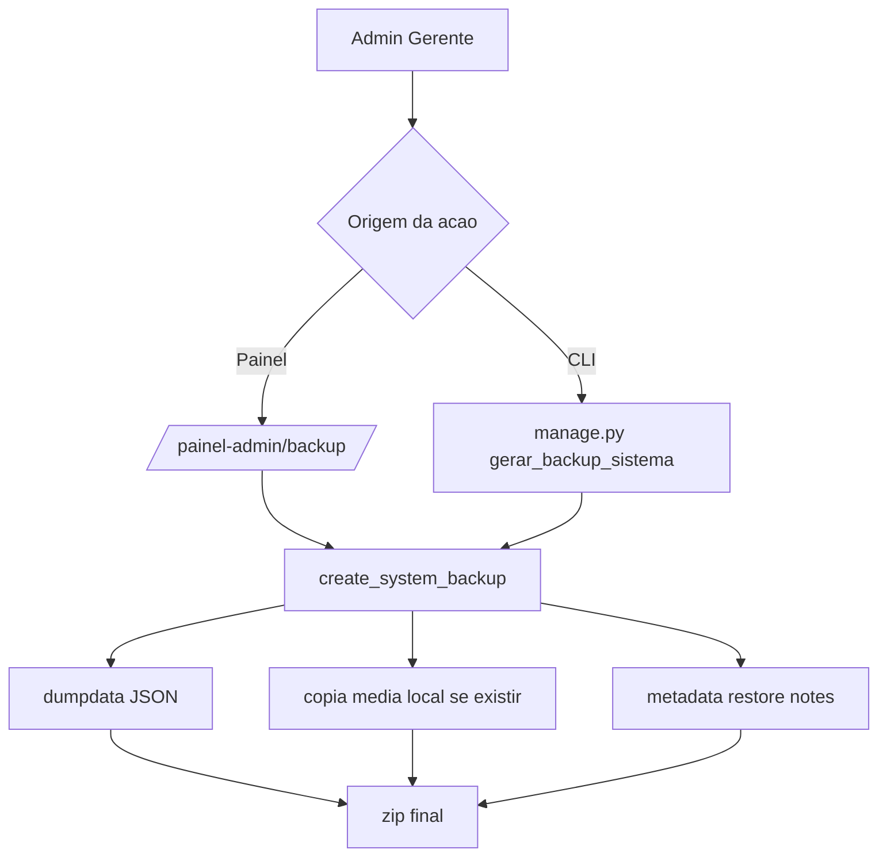
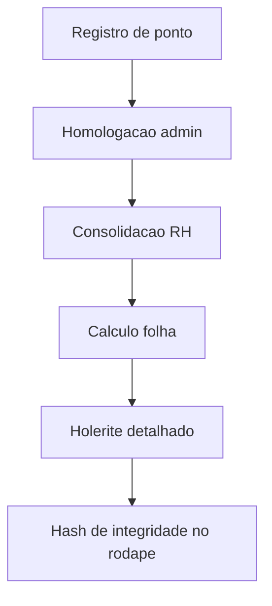
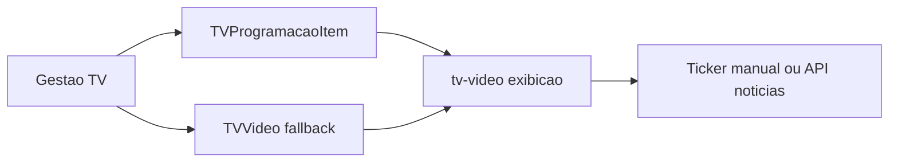

# 11 - Diagramas

## 1. Arquitetura Geral

## 2. Fluxo Comercial Lead ate Venda

## 3. Regras de Acesso

## 4. Auditoria de Escrita

## 5. Backup Operacional

## 6. Fluxo Ponto e Folha

## 7. TV Corporativa

