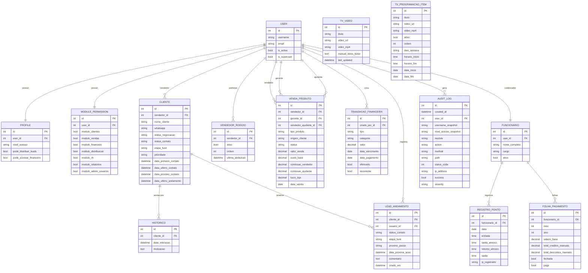

# 12 - Diagrama de Banco de Dados

Este diagrama representa as entidades centrais do sistema em nivel funcional.

## ER Principal

## Observacoes

- O diagrama e funcional e nao lista todos os campos tecnicos de cada app.
- Entidades centrais para BI comercial: `CLIENTE`, `LEAD_ANDAMENTO`, `VENDA_PRODUTO`.
- Entidades centrais para financeiro e RH: `TRANSACAO_FINANCEIRA`, `REGISTRO_PONTO`, `FOLHA_PAGAMENTO`.
- Entidade de governanca: `AUDIT_LOG`.
