# 12 - Diagrama de Banco de Dados

Este diagrama representa a estrutura principal do banco (visao funcional).  
Ele foca nas entidades mais importantes para operacao e analise.

## ER Principal

```mermaid
erDiagram
    USER {
      int id PK
      string username
      string email
      bool is_active
      bool is_superuser
    }

    PROFILE {
      int id PK
      int user_id FK
      string nivel_acesso
      bool pode_distribuir_leads
      bool pode_acessar_financeiro
      string avatar
    }

    MODULE_PERMISSION {
      int id PK
      int user_id FK
      bool modulo_clientes
      bool modulo_vendas
      bool modulo_financeiro
      bool modulo_distribuicao
      bool modulo_rh
      bool modulo_relatorios
      bool modulo_admin_usuarios
    }

    USER_LOGIN_ACTIVITY {
      int id PK
      int user_id FK
      datetime login_timestamp
      string ip_address
    }

    CLIENTE {
      int id PK
      int vendedor_id FK
      string nome_cliente
      string whatsapp
      string status_negociacao
      string tipo_negociacao
      datetime data_primeiro_contato
      datetime data_proximo_contato
    }

    HISTORICO {
      int id PK
      int cliente_id FK
      datetime data_interacao
      text motivacao
    }

    VENDEDOR_RODIZIO {
      int id PK
      int vendedor_id FK
      int ordem
      bool ativo
      datetime ultima_atribuicao
    }

    VENDA_PRODUTO {
      int id PK
      int vendedor_id FK
      int gerente_id FK
      int vendedor_ajudante_id FK
      string tipo_produto
      string origem_cliente
      string status
      decimal valor_venda
      decimal custo_base
      decimal comissao_vendedor
      decimal comissao_ajudante
      decimal lucro_loja
      date data_venda
    }

    FECHAMENTO_MENSAL {
      int id PK
      int responsavel_id FK
      int mes
      int ano
      datetime data_fechamento
    }

    TRANSACAO_FINANCEIRA {
      int id PK
      int criado_por_id FK
      string tipo
      string categoria
      string descricao
      decimal valor
      date data_vencimento
      date data_pagamento
      bool efetivado
      bool recorrente
    }

    FUNCIONARIO {
      int id PK
      int user_id FK
      string nome_completo
      string cargo
      bool ativo
    }

    REGISTRO_PONTO {
      int id PK
      int funcionario_id FK
      date data
      time entrada
      time saida_almoco
      time retorno_almoco
      time saida
      string ip_registrado
      string latitude
      string longitude
    }

    FOLHA_PAGAMENTO {
      int id PK
      int funcionario_id FK
      int mes
      int ano
      decimal salario_base
      decimal total_creditos_manuais
      decimal total_descontos_manuais
      bool fechada
    }

    CREDITO {
      int id PK
      int funcionario_id FK
      decimal valor_total
      int parcelas
      date data_inicio
    }

    DESCONTO {
      int id PK
      int funcionario_id FK
      decimal valor_total
      int parcelas
      date data_inicio
    }

    FICHA {
      int id PK
      int cliente_id FK
      string banco
      string status
      decimal valor
      datetime criado_em
    }

    CREDENCIAL {
      int id PK
      string titulo
      string usuario
      string senha
      string categoria
    }

    NOTIFICACAO {
      int id PK
      int user_id FK
      string titulo
      text mensagem
      bool lida
      datetime criada_em
    }

    AUTORIZACAO {
      int id PK
      int vendedor_id FK
      int gerente_id FK
      string status
      datetime data_solicitacao
      datetime data_aprovacao
    }

    PROCURACAO {
      int id PK
      int outorgado_id FK
      string tipo_documento
      string nome_outorgante
      date data_emissao
    }

    OUTORGADO {
      int id PK
      string nome
      string documento
    }

    AVALIACAO {
      int id PK
      int cadastrado_por_id FK
      string placa
      string marca
      string modelo
      decimal valor_fipe
      decimal valor_sugerido
      datetime criado_em
    }

    AVALIACAO_FOTO {
      int id PK
      int avaliacao_id FK
      string foto
    }

    USER ||--|| PROFILE : possui
    USER ||--|| MODULE_PERMISSION : possui
    USER ||--o{ USER_LOGIN_ACTIVITY : logins

    USER ||--o{ CLIENTE : vendedor
    CLIENTE ||--o{ HISTORICO : interacoes
    USER ||--o{ VENDEDOR_RODIZIO : participa

    USER ||--o{ VENDA_PRODUTO : vendedor
    USER ||--o{ VENDA_PRODUTO : gerente
    USER ||--o{ VENDA_PRODUTO : ajudante
    USER ||--o{ FECHAMENTO_MENSAL : responsavel
    USER ||--o{ TRANSACAO_FINANCEIRA : criou

    USER ||--|| FUNCIONARIO : dados_funcionais
    FUNCIONARIO ||--o{ REGISTRO_PONTO : registros
    FUNCIONARIO ||--o{ FOLHA_PAGAMENTO : folhas
    FUNCIONARIO ||--o{ CREDITO : creditos
    FUNCIONARIO ||--o{ DESCONTO : descontos

    CLIENTE ||--o{ FICHA : financiamentos

    USER ||--o{ NOTIFICACAO : recebe

    USER ||--o{ AUTORIZACAO : vendedor
    USER ||--o{ AUTORIZACAO : gerente

    OUTORGADO ||--o{ PROCURACAO : documentos

    USER ||--o{ AVALIACAO : cadastrou
    AVALIACAO ||--o{ AVALIACAO_FOTO : fotos
```

## Observacoes

- O diagrama e funcional (alto nivel) e nao lista 100% dos campos tecnicos.
- Para BI/relatorios, as tabelas mais centrais sao: `CLIENTE`, `VENDA_PRODUTO`, `TRANSACAO_FINANCEIRA`, `FOLHA_PAGAMENTO`.
- Para governanca de acesso, foco em: `PROFILE`, `MODULE_PERMISSION`, `USER_LOGIN_ACTIVITY`.
