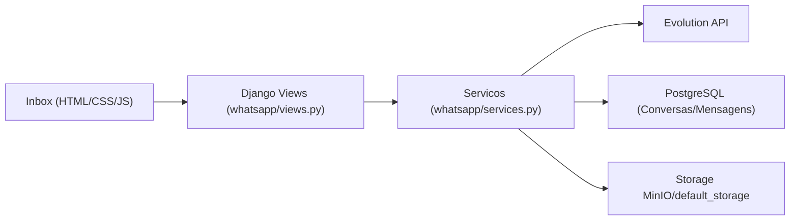
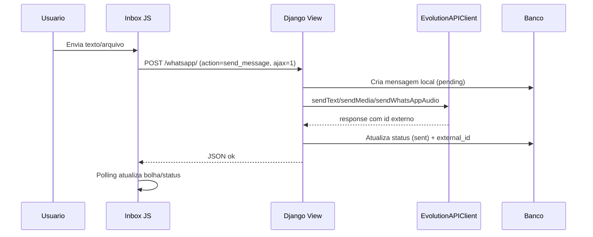
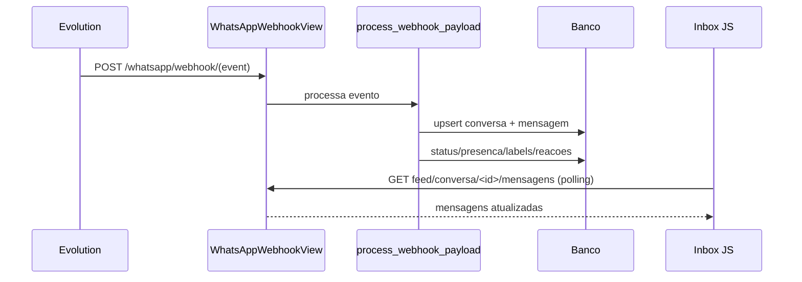
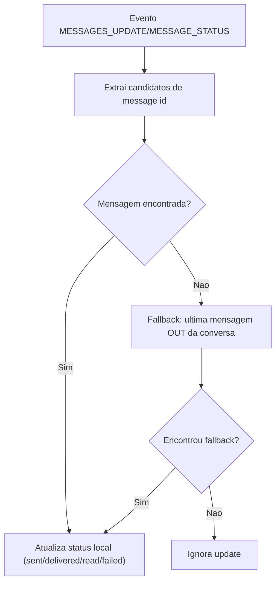
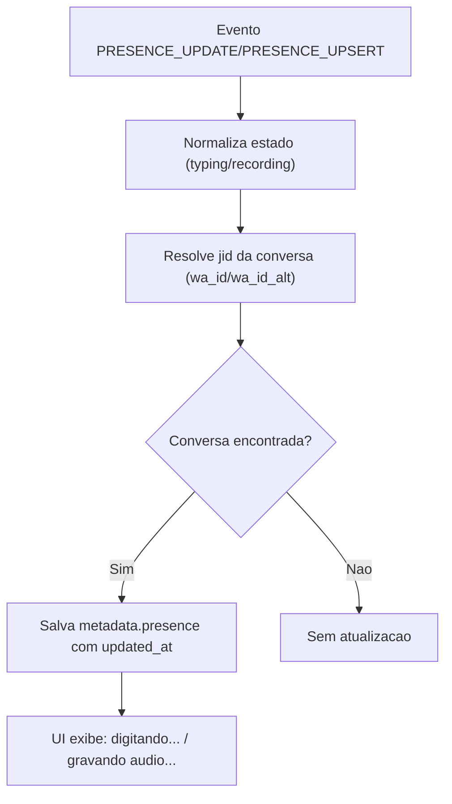
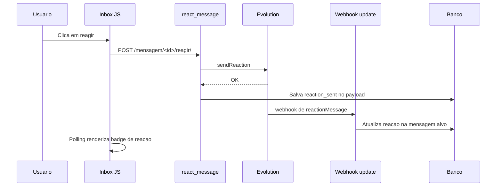
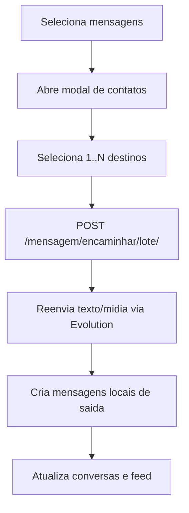
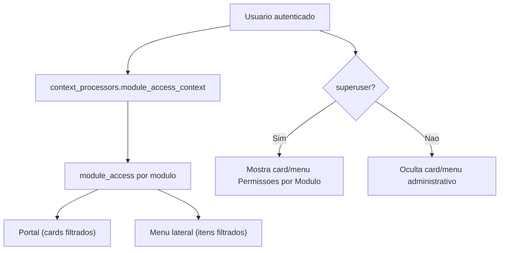
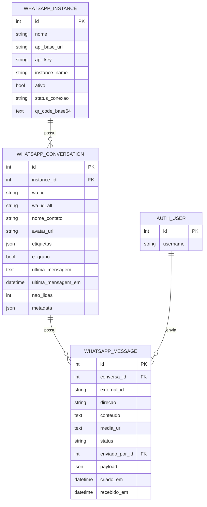

# 14 - Diagramas das Implementacoes Recentes

## 1. Arquitetura logica do modulo WhatsApp

## 2. Fluxo de envio de mensagem

## 3. Fluxo de recebimento via webhook

## 4. Fluxo de status (confirmacoes)

## 5. Fluxo de presenca (digitando/gravando)

## 6. Fluxo de reacao

## 7. Encaminhamento em lote

## 8. Controle de acesso no portal/menu

## 9. ER simplificado do modulo WhatsApp

